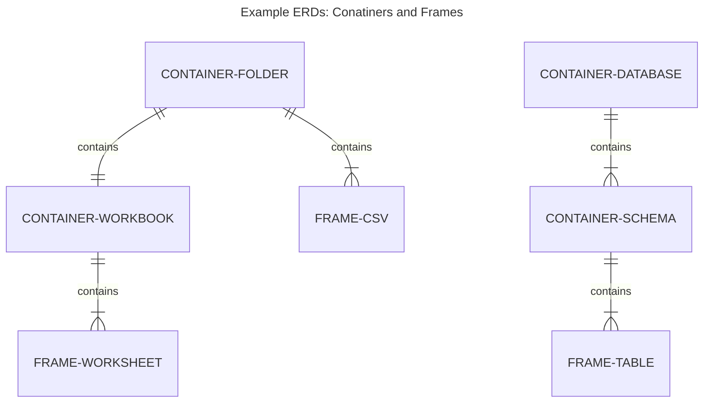

# eel

eel enables flow of data between multiple sources with minimal configuation.

## Dependencies

eel is python based and relies on the pandas library.

```bash
pip install pandas
```

## Basic usage

Pass a path and the contents of the file/folder will be output to the console.

```bash
eel.py test.xlsx       #output all worksheets in test.xlsx to screen
eel.py ./datdir/       #output all data files in ./datdir/ to screen
```

Passing two arguments explicitly defines the target:

```bash
eel.py test.xlsx ./output/       #load all test.xlsx worksheets to ./output/*.csv
eel.py ./datdir/ ./output/       #load all ./datdir/ data files to ./output/*.csv
```

These are two basic examples for getting started, more advanced usage requires more advanced concepts.

## eel object model

eel works with frames and containers as outlined in the below diagram:


### **Frame:** a tabular data object

* table
* csv
* tsv
* worksheet

### **Container:** a grouping of frames or other containers

* database
* schema
* directory
* workbook

Below are two examples of how containers and frames relate to files and databases:



Containers can be

* **homogeneous:** all member frames have the same structure,
so they may share the same target frame.
* **heterogeneous:** all member frames have different structure,
so they should have different target frames.
* **frameless:** no member frames


In the above dataflow diagram:

* inner boxes are frames
* all other boxes are containers
* transactions.xlsx (left) is a homogeneous container
* sql db (top-right) is a frameless container
* all other containers are heterogeneous

## Supported containers and frames

The following are supported as both sources and targets.

### Directory

by default, eel considers a folder as a container:

|                    | Type                  | eel object |
| ------------------ | --------------------- | ---------- |
| :white_check_mark: | file folder/directory | Container  |

### Data files

eel recognizes certain file extensions as valid data files:

|                      | Type    | Extension  | eel object |
| -------------------- | ------- | ---------- | ---------- |
| :white_check_mark:   | Excel   | xls[x,b,m] | Container  |
| :white_check_mark:   | text    | csv,tsv    | Frame      |
| :white_large_square: | parquet | parquet    | Frame      |
| :white_large_square: | pickle  | pickle     | Frame      |

### Databases

Database connections can be configured in an .eel.yml file and the following are supported for mvp1:

|                      | Type     | eel object |
| -------------------- | -------- | ---------- |
| :white_check_mark:   | mssql    | Container  |
| :white_check_mark:   | duckdb   | Container  |
| :white_large_square: | mysql    | Container  |
| :white_large_square: | postgres | Container  |
| :white_large_square: | sqllite  | Container  |

## data project: folder/file based

All data sources are defined in the file system, normally contained in a single data source folder.

* standard data files are treated as source files and do not require configuration
  * yourdata.csv
  * yourdata.xlsx
* standard data files can optionally be accompanied by a configuration file
  * yourdata.csv.eel.yml
  * yourdata.xlsx.eel.yml
* other sources and targets such as databases or remote files can be defined in a separate configuration file
  * yourconn.eel.yml
* folders can have a global configuration file which by default propagates to all containing files and subfolders
  * .eel.yml

There are three scenarios for defining a source (frame or container):

* a data file (.csv, .xlsx)
* a data file with an accompanying .eel.yml (eel pair)
* an .eel.yml defining a connection or path to a data file

or:

* lone data: default behavious executed based on file type
* eel pair: same as above, except defaults are overridden by eel.yml definition
* eel.yml: similar to above, except source has to be explicitly defined

There are three scenarios for defining a target:

* eel.yml
* second argument in the cli call

Defining a target may involve having to define a container and frame separately, here is a typical scenario where multiple source files are loaded to different tables (frames) in a single database (container).

* target database (container) is defined in a glabal .eel.yml file in the source folder
* target frames (tables) are by default the names of the files and/or worksheets
* in the case of a heterogeneous container, the name of the container is the default target frame
* any defaults defined above can be overridden in a global or paired .eel.yml file

An example use case would have a folder containing all source files and a single .eel.yaml file defining a target database container.

```bash
└───data_sources                    # folder
        .eel.yml                    # defines target container for folder
        customers.xlsx              # implicit target frames = names of worksheets
        products.csv                # implicit target frame = file base (products)
        transactions.xlsx           # explicit target frame defined in 
        transactions.xlsx.eel.yml   #  transactions.xlsx.eel.yml
```

### usage

```bash
eel.py ./data sources/  #recursively iterate all folders and files (recognized 
                        #data files + *.eel.yml configs) and load to defined target(s)
```

## config / *.eel.yaml

One or more .eel.yaml files may define:

* frame/container source
  * in file content
  * in file name (eel pair)
* frame/container target
  * in file content
  * inherit from global eel.yaml
* column names and types
* source type: frame or container
* target type: frame or container
* allow parallel=true
* sample n=# or n=%
* environment
* if target exists: drop or truncate or append
* propagete to child folder/files: yes/no
* small-t transformations
* last imported?

## small-t transforms

Some intra-frame transformations are supported:

* add index / unique id
* unpivot / melt data
* include file details
* include frame specific properties from homogeneous containers
* include custom columns defined in eel.yaml
