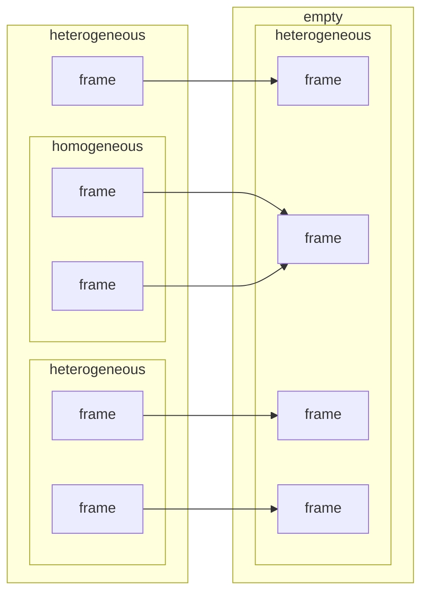
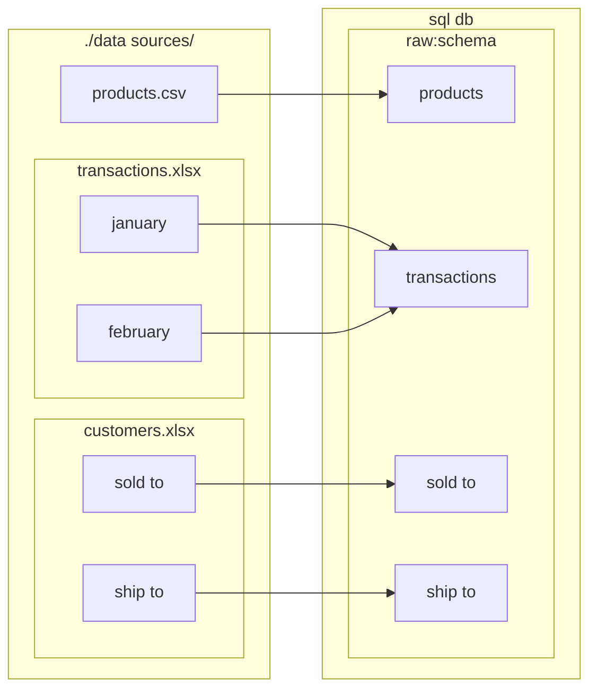
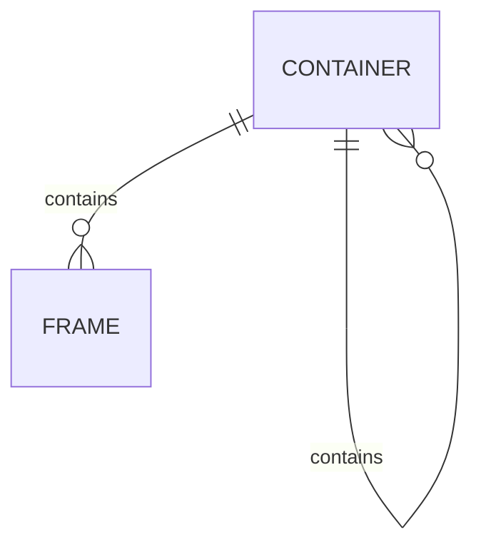
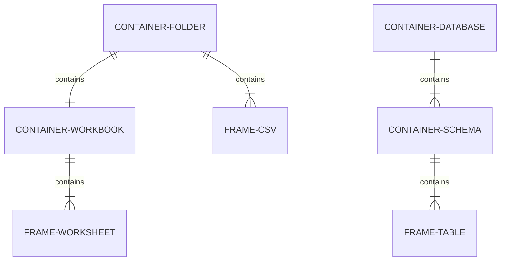

# eel

eel enables flow of data between multiple sources with minimal configuation.

## Dependencies

eel is python based and relies on the pandas library.

```bash
pip install pandas
```

## Basic usage

Pass a path and the contents of the file/folder will be output to the console.

```bash
eel.py test.xlsx       #output all worksheets in test.xlsx to screen
eel.py ./datdir/       #output all data files in ./datdir/ to screen
```

Passing two arguments explicitly defines the target:

```bash
eel.py test.xlsx ./output/       #load all test.xlsx worksheets to ./output/*.csv
eel.py ./datdir/ ./output/       #load all ./datdir/ data files to ./output/*.csv
```

## Supported file types

eel automatically recognizes certain file types as valid data files:

| Type    | Extension | eel model | mvp1 | mvp2 |
| ------- | --------- | --------- | ---- | ---- |
| Excel   | xls[x,b,m]  | Container | :heavy_check_mark:     |      |
| text    | csv,tsv   | Frame     |      |      |
| parquet | parquet   | Frame     |      |      |
| pickle  | pickle    | Frame     |      |      |

These are two basic examples for getting started,
more advanced usage requires more advanced concepts.

## data project: folder/file based

All data sources are defined in the file system,
normally in a single data source folder.

* standard data files are treated as source files and do not require configuration
  * .csv
  * .xlsx
* data files can optionally be accompanied by a configuration file
  * .csv.eel.yml
  * .xlsx.eel.yml
* other sources and destinations such as databases or remote files
can be defined in a separate configuration file
  * .eel.yml
* folders can have a single configuration file which by default propagates
to all containing files and subfolders
  * eel.yml

A typical use case would have a folder containing all source files and a single
.eel.yaml file defining a target database.

```bash
└───data_sources                    # folder
        .eel.yml                    # defines target container for folder
        customers.xlsx              # implicit target frames = names of worksheets
        products.csv                # implicit target frame = file base (products)
        transactions.xlsx           # explicit target frame defined in 
        transactions.xlsx.eel.yml   #  transactions.xlsx.eel.yml
```

### usage

```bash
eel.py ./data sources/  #recursively iterate all folders and files (recognized 
                        #data files + *.eel.yml configs) and load to defined target(s)
```

## config / *.eel.yaml

One or more .eel.yaml files may define:

* frame/container source
  * Explicit in yml file content
  * Implicit in yml file name
* frame/container target
  * Explicit in yml file
  * Can inherit from folder/parent folder eel.yaml
* column names and types
* source type: frame or container
* allow parallel
* small-t transformations
* sample n=# or n=%
* environment
* if target exists: drop or truncate or append
* propagete to child folder/files: yes/no
* last imported?

## small-t transforms

Some intra-frame transformations are supported:

* add index / unique id
* unpivot / melt data
* include file details
* include frame specific properties from homogeneous containers
* include custom columns defined in eel.yaml

## eel object model

eel defines two principal data objects:

**frame:** a tabular data object represented in:

* table
* csv
* tsv
* worksheet

**container:** a grouping of frames or other containers represented in:

* database
* schema
* directory
* workbook

containers can be

* **homogeneous:** all member frames have the same structure,
so they may share the same target frame.
* **heterogeneous:** all member frames have different structure,
so they should have different target frames.
* **frameless:** no member frames, may contain other containers

## diagrams

<details>
<summary>abstract eel dataflow</summary>



</details>

<details>
<summary>example eel dataflow</summary>



</details>

<details>
<summary>Abstract ERD: Conatiners and Frames</summary>



</details>

<details>
<summary>Example ERDs: Conatiners and Frames</summary>



</details>
