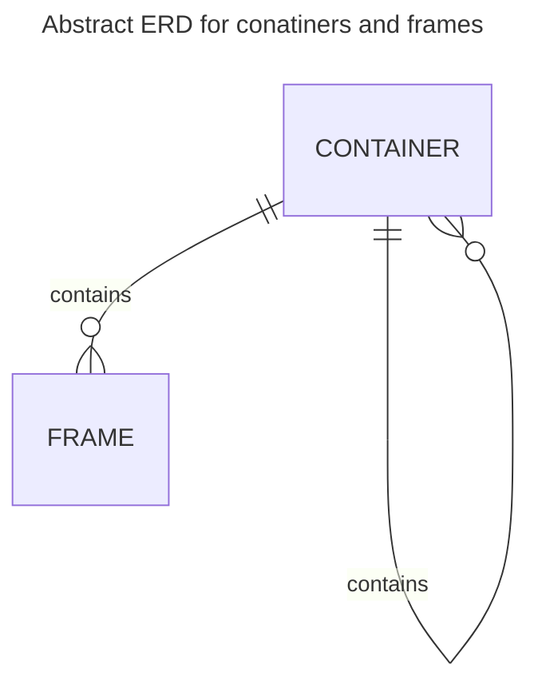
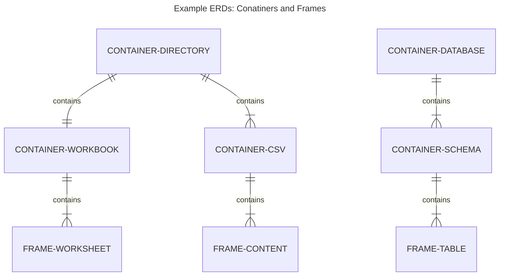
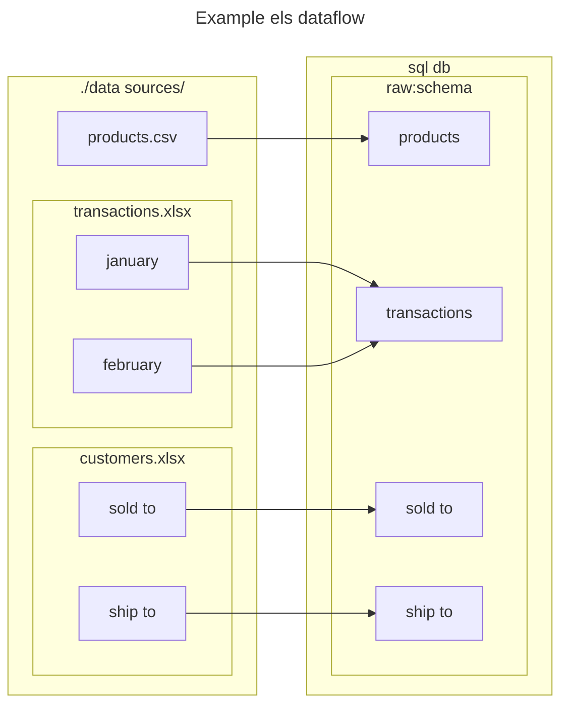

# ELS

ELS is a command line tool and yaml schema for extracting and loading data between multiple sources.

## Install

ELS is python based and can be installed with pip.

```bash
pip install els
```

## Basic usage: no yml

When working with data files the command line will work. Pass a path and the contents of the file/folder will be output to the console.

```bash
els.py test.xlsx       #output all worksheets in test.xlsx to screen
els.py ./datdir/       #output all data files in ./datdir/ to screen
```

Passing more than one arguments explicitly defines the target (first arg) and the sources (next arguments):

```bash
els.py ./output/ test.xlsx       #load all test.xlsx worksheets to ./output/*.csv
els.py ./output/ ./datdir/       #load all ./datdir/ data files to ./output/*.csv
els.py .janfeb.csv jan.csv feb.csv       #load jan.csv and feb.csv to janfeb.csv
```

## One target : many source convention

Define a target (container or frame) and then one or more sources (container or frame) facilitates:

- Do not Repeat Yourself (DRY) approach for typical ELT environments where a single target database is a common use case.
- use case where multiple frames feed a single table.

## Advanced usage

When using databases and remote files, the .els.yml files will have to be used.

## els object model

els works with frames and containers as outlined in the below diagram:



### **Frame:** a tabular data object

- table
- csv
- tsv
- worksheet

### **Container:** a grouping of frames or other containers

- database
- schema
- workbook
- directory with files
- .els.yml file
- .els.yml document

Below are two examples of how containers and frames relate to files and databases:



Containers can be

- **homogeneous:** all member frames have the same structure, so they may share the same target frame. (only supported as a source)
- **heterogeneous:** all member frames have different structure, so they should have different target frames.
- **frameless:** no member frames



```{.mermaid loc=img format=svg theme=neutral caption=dataflow}
---
title: Example dataflow
---
flowchart LR
    subgraph fs:./data sources/
        a1[products.csv]
        subgraph transactions.xlsx/sheets/
            z1[january]
            y1[february]
        end
        subgraph customers.xlsx/sheets/
            x1[sold to]
            w1[ship to]
        end
    end
      subgraph db:target_db/tables/
          a1 --> b1[products]
          z1 --> d1[transactions]
          y1 --> d1
          x1 --> u1[sold to]
          w1 --> v1[ship to]
      end
```

In the above dataflow diagram:

- inner boxes are frames
- all other boxes are containers
- transactions.xlsx (left) is a homogeneous container
- sql db (top-right) is a frameless container
- all other containers are heterogeneous

Another way to think about the els object model is that they form a tree with branches and leafs:

| els object              | tree analog |
| :---------------------- | :---------- |
| frame                   | leaf        |
| container-homogeneous   | leaf        |
| container-heterogeneous | branch      |
| container-frameless     | branch      |

## Supported containers and frames

The following are supported as both sources and targets.

### Directory

by default, els considers a folder as a container:

|                    | Type                  | els object |
| ------------------ | --------------------- | ---------- |
| :white_check_mark: | file folder/directory | Container  |

### Data files

els recognizes certain file extensions as valid data files:

|                      | Type    | Extension  | els object |
| -------------------- | ------- | ---------- | ---------- |
| :white_check_mark:   | Excel   | xls[x,b,m] | Container  |
| :white_check_mark:   | text    | csv,tsv    | Frame      |
| :white_large_square: | parquet | parquet    | Frame      |
| :white_large_square: | pickle  | pickle     | Frame      |

### Databases

Database connections can be configured in an .els.yml file and the following are supported for mvp1:

|                      | Type     | els object |
| -------------------- | -------- | ---------- |
| :white_check_mark:   | mssql    | Container  |
| :white_check_mark:   | duckdb   | Container  |
| :white_large_square: | mysql    | Container  |
| :white_large_square: | postgres | Container  |
| :white_large_square: | sqllite  | Container  |

## data project: folder/file based

All data sources are defined in the file system, normally contained in a single data source folder.

### Recognized data files are treated as source files and do not require configuration

```bash
yourdata.csv
yourdata.xlsx
```

### Recognized data files can optionally be accompanied by a .els.yml configuration file

```bash
yourdata.csv
yourdata.csv.els.yml
yourdata.xlsx
yourdata.xlsx.els.yml
```

### Other stores such as databases or remote files can be defined in a .els.yml configuration file

```bash
yourconn.els.yml
```

### Folders can have a global configuration file which by default propagates to all containing files and subfolders

```bash
_.els.yml
```

## Sources and Targets

An els flow involves a single data source and target. Sources have some similarities and differences outlines below:

## Sources (the extract bit)

Here are some scenarios for defining a source frame or container:

|           |                                      | file               | dir                | db                 |
| :-------- | :----------------------------------- | :----------------- | :----------------- | :----------------- |
| lone data | data file (.csv, .xlsx)              | :white_check_mark: |                    |                    |
| els pair  | data file with accompanying .els.yml | :white_check_mark: |                    |                    |
| lone els  | .els.yml with source defined         | :white_check_mark: | :white_check_mark: | :white_check_mark: |

- lone data and els pair sources can be either a frame or a container
- lone els sources can be either be a database connection and point to a table or schema or a remote file

## Targets (the load bit)

There are three scenarios for defining a target:

| source type             |    target file     |    target table    |     target dir     |     target db      |
| :---------------------- | :----------------: | :----------------: | :----------------: | :----------------: |
| frame                   | :white_check_mark: | :white_check_mark: |                    |                    |
| homogeneous container   | :white_check_mark: | :white_check_mark: |                    |                    |
| heterogeneous container |                    |                    | :white_check_mark: | :white_check_mark: |

Supported source to target types.

| source type             |    target frame    |  target container  |
| :---------------------- | :----------------: | :----------------: |
| frame                   | :white_check_mark: |                    |
| homogeneous container   | :white_check_mark: |                    |
| heterogeneous container |                    | :white_check_mark: |

- els.yml
- second argument in the cli call

Defining a target may involve having to define a container and frame separately, here is a typical scenario where multiple source files are loaded to different tables (frames) in a single database (container).

- target database (container) is defined in a glabal .els.yml file in the source folder
- target frames (tables) are by default the names of the files and/or worksheets
- in the case of a heterogeneous container, the name of the container is the default target frame
- any defaults defined above can be overridden in a global or paired .els.yml file

An example use case would have a folder containing all source files and a single .els.yaml file defining a target database container.

```bash
└───data_sources                    # folder
        .els.yml                    # defines target container for folder
        customers.xlsx              # implicit target frames = names of worksheets
        products.csv                # implicit target frame = file base (products)
        transactions.xlsx           # explicit target frame defined in
        transactions.xlsx.els.yml   #  transactions.xlsx.els.yml
```

### usage

```bash
els.py ./data sources/  #recursively iterate all folders and files (recognized
                        #data files + *.els.yml configs) and load to defined target(s)
```

## config / \*.els.yaml

One or more .els.yaml files may define:

- frame/container source
  - in file content
  - in file name (els pair)
- frame/container target
  - in file content
  - inherit from global els.yaml
- column names and types
- source type: frame or container
- target type: frame or container
- allow parallel=true
- sample n=# or n=%
- environment
- if target exists: drop or truncate or append
- propagete to child folder/files: yes/no
- small-t transformations
- last imported?

## small-t transforms

Some intra-frame transformations are supported:

- add index / unique id
- unpivot / melt data
- include file details
- include frame specific properties from homogeneous containers
- include custom columns defined in els.yaml
