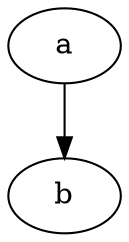
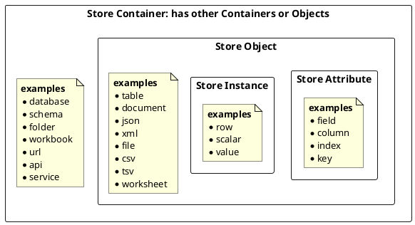
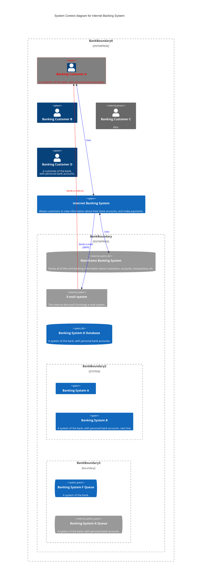

# eel: easy extract load

First target use case is to create a decalrative language (eel.yaml) to quickly spin up a data project from multiple sources.

## easy

Ease of use and forgivable/optional syntax are a design priority. All required is a valid (file,folder,url) to get started. With only one data source/store declared, the contents of the file will be output to the screen.

## extract

By default, data defined will be the source.

## load

Load should be defined in an eel.yaml file. The location of this file will be assumed to be in the same folder as the file which defined the source.

## small-t transform

Some transformations will be supported, as the product matures more should be added. Some examples of mvp1 transforms:

* add index / unique id
* unpivot / melt data
* include file details
* include custom columns defined in eel.yaml

## eel.yaml

Optional, if not included then file content output to console. Otherwise:

* Defines source
* Explicit 
* Implicit same as yaml file name and in same directory
* Can be:
* Single file (csv, )
* Multiple files
* Multiple sheets from a single file
* read_sql
* read_csv
* read_parquet
* Define destination

Data store types for mvp1: (sql/csv/excel/parquet)

