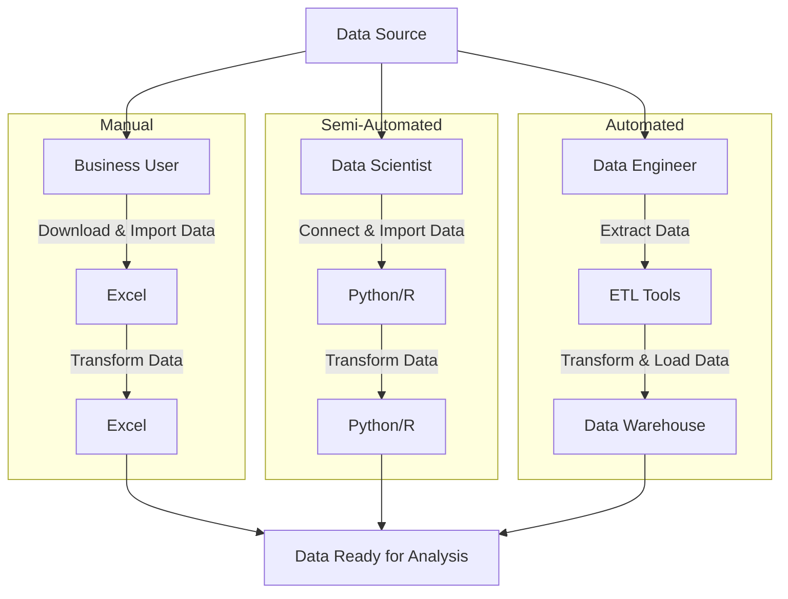
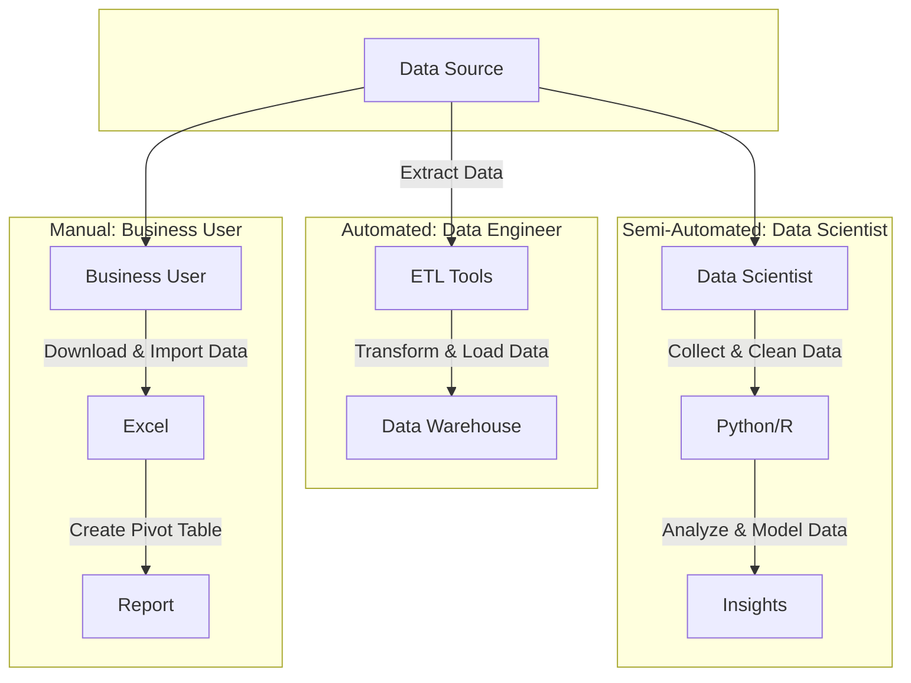
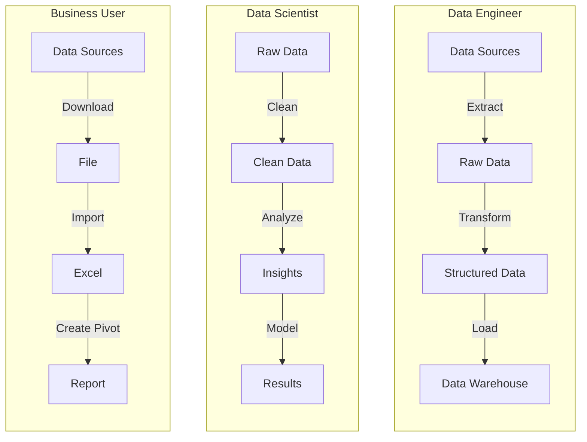

# Test

## Dataflow System Use Case: Process Data Stream

### Description:

This use case describes the process of ingesting, transforming, and storing a continuous stream of data in a dataflow system.

### Actors:

- Data Producer: Source of the data stream.
- Dataflow System: System responsible for processing and storing the data.

### Preconditions:

- The dataflow system is operational and configured to receive data.
- Data producers have established connections with the dataflow system.

### Triggers:

- Arrival of new data from the data producer.

### Basic Flow:

1. Data Producer sends a data stream to the Dataflow System.
2. Dataflow System ingests the incoming data stream.
3. Dataflow System applies defined transformations (e.g., filtering, aggregation) to the data.
4. Transformed data is stored in the appropriate data store or destination.

### Alternative Flows:

- If the incoming data stream is invalid or contains errors:
  - Dataflow System logs the error.
  - Dataflow System may attempt to recover or notify appropriate stakeholders.
- If the dataflow system encounters processing issues:
  - Error handling mechanisms are triggered.
  - System attempts to recover or notifies administrators.

### Postconditions:

- Transformed data is successfully stored in the designated data store.
- Dataflow System is ready to receive and process the next data stream.

### Exceptional Conditions:

- Loss of connectivity between Data Producer and Dataflow System.
- Dataflow System hardware or software failures.
- Data stream contains unexpected or invalid data.

### Related Use Cases:

- Dataflow System Use Case: Data Transformation
- Dataflow System Use Case: Data Visualization
- Dataflow System Use Case: Data Monitoring

### Notes:

- This use case focuses on the core process of processing data streams within the dataflow system.
- Additional use cases may address specific aspects such as data validation, real-time analytics, or system maintenance.





```{.mermaid loc=img format=svg theme=neutral caption=usecases}
---
title: Overview of three data pipeline use cases.
---
graph TB
    S[Data Sources] --> G
    S --> D
    S --> A
    subgraph " "
    direction TB
        G[Data Engineer] -->|Extract Data| H[ETL Tools]
        H -->|Transform & Load Data| I[Data Warehouse]
    end
    subgraph " "
    direction TB
        D[Data Scientist] -->|Connect & Import Data| E[Python/R]
        E -->|Transform Data| F[Python/R]
    end
    subgraph " "
    direction TB
        A[Business User] -->|Download & Import Data| B[Excel]
        B -->|Transform Data| C[Excel]
    end
    C-->T[Data Ready for Analysis]
    F-->T
    I-->T
```

```{.mermaid loc=img format=svg theme=neutral caption=gantt}
%%{init: {'theme': 'default', 'flowchart': { 'curve': 'linear' }}}%%
graph TD;
    DataProducer-->|Sends Data Stream|DataflowSystem;
    DataflowSystem-->|Ingests Data|DataTransformation;
    DataTransformation-->|Applies Transformations|DataStorage;
    DataStorage-->|Stores Transformed Data|Destination;

```



```{.mermaid loc=img format=svg theme=neutral caption=gantt}
---
title: Gantt Chart of the activities defined for this project.
---
journey
    title Data Journey
    section Manual
      Download Data: 1: Data, Business
      Paste into Excel: 1: Data, Business
      Create Pivot: 2: Business
    section Semi-Automated
      Refresh Data: 2: Data, Business
      Analyse: 3: Data, Business
    section Fully-Automated
```

```{.mermaid loc=img format=svg theme=neutral caption=gantt}
---
title: Gantt Chart of the activities defined for this project.
---
journey
    title Data Journey
      Unavailable: 0
    section Manual
      Downloaded manually: 1: Analyst
      Extracted with script: 2: Scientist
    section Automated
      Extracted with tools: 3: Engineer
      On schedule: 4: Engineer
      Cost Optimised: 5: Cost Engineer
```

```{.mermaid loc=img format=svg theme=neutral caption=gantt}
---
title: Data Journey
---
journey
    section Manual
      Downloaded: 0: Business User
      Extracted with script: 2: Data Scientist
    section Automated
      Extracted with ETL tools: 4: Data Engineer
      On schedule: 6: Data Engineer
      Cost Optimised: 8: Cost Engineer
```

<!-- Although data pipelines are often addressed in the context of engineering big data systems, the proposal put forth in this document will consider a broader scope of the term which also includes small data use cases, some of which are listed below and summarised in [Figure @fig:usecases]. -->

 <!-- [Figure @fig:usecases] gives an overivew of each of the use cases. -->
<!-- Each use case has the same _Source Endpoint_, but a different _Target Endpoint_. -->

<!-- The early stages of a data project often involve a consolidation of multiple datasets into a single data store or project spanning one or more tables. This paper will use the data engineering term _data ingestion_ to refer to this phase, concretely: the process of copying data from one or more sources to a single target. [Figure @fig:dataflow] below shows an example of a dataflow with multiple files landing in a single database schema, although the destination could also be a python project or another set of files in a folder. -->

<!-- Each of the use cases above involve a data pipeline which moves and transforms data to a destination. The classic sub-pattern of data pipelines is ETL (Extract-Transform-Load), however this proposal will focus on a sub-pattern called _ingestion_. _Ingestion_ has two functions: (1) its primary function is on the Extract-Load part of the pipeline; (2) with a secondary function performing transformations [@pipelines_pocket, p. 106] as part of the process. -->

<!-- [Table @tbl:elt] provides further descriptions of common pipeline patterns, it also provides some scope details relating to the project proposed in this paper. -->

<!-- - avoid technical terms (e.g., non-contextual transformation) in the introduction; it should be accessible to anyone with CS background -->

<!-- : Project scope via pipeline patterns. {#tbl:elt}

|      | Stands for         | Description                 | In scope |
| ---- | ------------------ | --------------------------- | -------- |
| E    | Extract            | Extracting data from source | Yes      |
| t    | Small-t transforms | Non-contextual transforms   | Yes      |
| L    | Load               | Saving data to its target   | Yes      |
| T    | Big-t transforms   | contextual transformations  | No       |
| ETL  |                    | Classic pattern: T before L | No       |
| ELT  |                    | Modern pattern: T after L   | No       |
| EtLT |                    | Modern pattern: small/big T | No       |
| EtL  |                    | Sub-pattern: ingestion      | Yes      | -->

<!-- - Table 2: at this point I don't know what is the problem you're trying to solve, so having pipeline patterns listed here and whether they are in the project scope is not particularly useful for the reader

- Table 1/2/3: I find them not much informative, sparse, and out-of-context. Better explain few cases in text

For the purpose of this paper, non-contextual transformations are defined as those which can be executed using information in a single tabular dataset. Using relational database (SQL) lingo, non-contextual transformations cannot use a `JOIN` clause to refer to data from another table. [Table @tbl:tfm] gives some examples of common examples of these transformations. Conversely, contextual transformations are those that combine two or more datasets/tables and are not in scope for the proposed project. -->

<!-- : Project scope via non-contextual transformations. {#tbl:tfm}

| Transformation           | Example                      | In scope |
| ------------------------ | ---------------------------- | -------- |
| Create/drop column       | Create row identifier column | Yes      |
| Convert data types       | String to date               | Yes      |
| Filter rows              | Remove duplicates            | Maybe    |
| Split/join strings       | Concatenate columns          | Maybe    |
| Obfuscate sensitive data | Encrypt birth date           | No       |
| Aggregate                | Sum total revenue by year    | No       | -->

<!-- The problems and solutions put forth in this document focus on application in the business context, especially internal-facing data products such as analytical reports and dashboards. Despite this narrow focus in examples and use cases, it is expected that the solutions proposed may also be used in outward-facing data product projects as well as in research and academia. -->

<!-- - Files usually come from different systmes and have very different formats.
- As the project progresses, gaps in data sources are identified and filled with more files.
- As the project progresses from an ad-hoc prototype to a sustainable solution, some data sources move from file-based to API/connection based.
- There is a dual requirement to explain how data has been transformed: one way to business users for sign off and another to technical users for handover. -->

```{.mermaid loc=img format=svg theme=neutral caption=sequencedp2}
---
title: Evolution of an internal-facing data product with lineage.
---
sequenceDiagram
    autonumber
    box
      actor Business as Business User
      actor Scientist as Data Scientist
      actor Engineer as Data Engineer
    end
    participant Data
    Business->>+Scientist: Can you make this?
    Scientist->Data: Create a data product to ingest (in-memory) and serve
    Scientist->>-Business: Sure, here you go
    Business->>+Scientist: Can you explain the lineage?
    Scientist->Scientist: Manually create a business lineage graph explaining data
    Scientist->>-Business: Here is a business graph
    Business->>+Engineer: Can you automate this?
    Engineer->>+Scientist: Can you explain?
    Scientist->Scientist: Manually create a technical lineage graph explaining data
    Scientist->>-Engineer: Here is a technical graph
    Engineer->Data: Use ETL tools to<br>ingest (persisted)<br>on schedule
    Engineer->>-Business: Sure, here it is in real-time
```

Another challenge with pipelines is the ability to communicate explanations of data pipelines across a diverse team. [Figure @fig:sequencedp2] shows a scenario where the problem in focus is how the pipeline can be explained to different types of users: business (Point 5) and technical (Point 9). With a pipeline defined in a plain text configuration language as proposed, it is trivial to extract and present lineage graphs. A common way to communicate data pipelines is to use a Directed Acyclic Graph (DAG) to show how different parts of the data are related.

<!-- **Notes**

-
- Data Scientist is responsible for documenting details of each step such as data sources used, date accessed, cleansing/transformations performed, altough most of these steps can still be determined by examining the Python scripts. -->

**Notes**

<!-- -  -->
<!-- - Business User is responsible for documenting details of each step such as data sources used, date accessed, cleansing/transformations performed. -->

 <!-- is a semi-automated process, setup is manual but repetition and iteration can be automated with the Python scripts used. -->

<!-- **Notes**

-
- Data Engineer is responsible for documenting details of each step such as data sources used, date accessed, cleansing/transformations performed, altough most of these steps can still be determined by examining the ETL scripts and/or workflows. Most advanced ETL tools have the ability to store metadata on each pipeline workflow. -->

<!-- This is mostly a manual process, though some more technically savvy users may automate some parts of the process. -->

### Use Cases

This section lists examples of data pipeline use cases, each use case contains a single actor and gives a basic example of how each actor may use a pipeline.

#### Business user pipeline destined for Excel

This use case describes a non-technical business user performing a manual process of downloading one or more files for consolidation and analysis in Excel.

Use Case Flow:

1. Business User manually downloads one or more datasets in Excel, csv or similar file formats from online portal, application or email.
2. Business User copies/pastes or imports data into a single Excel file.
3. Business User performs transformations on data.
4. Data is ready for analysis/pivots.

```{.mermaid loc=img format=svg theme=neutral caption=dp1}
---
title: Business user pipeline.
---
graph LR
    S["Web\nPortal"] -->|"Download"| B[File\nSystem]
    B -->|"Import"| C[Excel]
    C -->|Transform| C
```

#### Data science pipeline using Python

This use case describes a data scientist connecting to or downloading one or more data sources for consolidation and analysis in Python. This process can be manual, automated or a combination of both.

Use Case Flow:

1. Data Scientist downloads data in Excel, csv or similar file formats from online portal or application, and/or connects directly to data via database connection or API.
2. Data Scientist creates script(s) to load datasets into pandas dataframes.
3. Data Scientist scripts transformations on data.
4. After running scripts, data is ready for analysis in pandas dataframe endpoints.

```{.mermaid loc=img format=svg theme=neutral caption=dp2}
---
title: Data science pipeline.
---
graph LR
   T["Web\nPortal"] -->|"Download"| B[File\nSystem]
   B -->|"Load via\nScript"| E
     S["API"] -->|Load via\nScript| E[Python]
    E -->|Transform| E
```

#### Data engineering pipeline using ETL tools

This use case describes a data engineer setting up ETL tools to connect to one or more data sources for consolidation and serving in a data warehouse or similar. Setup is manual but ETL process is normally repeted on a schedule using ETL tooling.

Use Case Flow:

1. Data Engineer connects directly to data via database connection or API.
2. Data Engineer uses ETL tools to load data in an intermediate storage or in-memory for transformations.
3. Data Engineer users ETL tools to performs transformations and/or cleansing operations on data.
4. Data Engineer loads data to a data warehouse or similar storage, ready for downstream analysis.

```{.mermaid loc=img format=svg theme=neutral caption=dp3}
---
title: Data engineering pipeline.
---
graph LR
    S["Database"] -->|Load via\nETL System| H[ETL System]
    H -->|Transform| H
    H -->|Load via\nETL System| I[Data\nWarehouse]

```

```{.mermaid loc=img format=svg theme=neutral caption=dp0}
---
title: Generic data pipeline.
---
graph LR
A["Source\nEndpoint"] --> B[Staging\nEndpoint]
B -. Transform .-> B
B --> C[Target\nEndpoint]
C -. Transform .-> C
%% C <-->|Serve| D[Consumer]
```

<!-- Data can be _transformed_ at any of the endpoints, but transformations rarely occurs at the source. -->

```{.mermaid loc=img format=svg theme=neutral caption=dp01}
---
title: Generic data pipeline.
---
graph LR
A["Source\nEndpoint"] --> B[Staging\nEndpoint]
B -. Transform .-> B
B --> C[Target\nEndpoint]
C -. Transform .-> C
%% C <-->|Serve| D[Consumer]
```

```{.mermaid loc=img format=svg theme=neutral caption=dp1}
---
title: Data pipeline project phase 1 to-be.
---
graph LR

subgraph "config"
  T
  B
end

  T["Web"] -->|"Download"| B[File\nSystem]
  T -->|Scrape Script| E
  F["Email"] -->|"Download"| B[File\nSystem]
  B -->|"Load\nScript"| E
  S["API"] -->|Load\nScript| E[Python]
  E -->|Transform\nScript| E
  E -->|Load\nScript| Q[SQL DB]
  Q -->|Transform\nViews| Q
  Q -->|Load\nScript| X[Target]
```

```{.mermaid loc=img format=svg theme=neutral caption=dp2}
---
title: Data pipeline project phase 2.
---
graph LR
  T[Web] -->|Scrape Script| E
  F["Database"] -->|"Load\nScript"| B[Network\nShare]
  B -->|"Load\nScript"| E
  S["API"] -->|Load\nScript| E[ETL\nSystem]
  E -->|Transforms| E
  E -->|Load\nScript| X[Target]
```

Pipelines are made up of one or more pipeline units, each unit connects two _endpoints_.

```{.mermaid loc=img format=svg theme=neutral caption=dp0}
---
title: Generic data pipeline.
---
graph LR
A["Endpoint 0"] -->|Pipeline Unit| B[Endpoint 1]
B -->|Pipeline Unit| C[Endpoint 2]
%% C <-->|Serve| D[Consumer]
```

```{.mermaid loc=img format=svg theme=neutral caption=dp0}
---
title: Data pipeline example.
---
graph LR
A[csv file] -->|Load| B[Database]
B-->|Transform|B
B -->|Load| C[Reporting System]
%% C <-->|Serve| D[Consumer]
```

Linkage

<!-- [Figure @fig:sequence0] shows a simple example of a data pipeline representing the minimal number of components. In reality a data pipeline could have several intermediate enpoints and multipe engines. -->

<!-- , and a single pipeline could also have several different engines working at different points of the pipeline. -->

<!-- , while creating quality documentation that can be used to communicate how data is moved and transformed from source to target. -->

<!-- In this work I have identified several challanges that no existing system can solve. -->

- Multiple data pipelines for multiple projects managed simultaneously. Solution requires a system to move the source data into a target database into tables. The point here is that someone who only ever deals with a single data pipeline can use existing tools as the percentage of time taken to manage this part of the project decreases significantly.

<!-- The processes that move and transform the data along a pipeline begin and end at _endpoints_. An _endpoint_ is place or interface where data is stored and/or accessed. This can be a data file such as a csv, a database, an API or an in-memory structure such as a dataframe. Endpoints will be discussed below in terms of _Data Sources_ and _Data Targets_. -->

<!-- Two There are two types of endpoints that will be discussed in this paper: _Source_ and _Target_ which is whre the pipleline begins and ends. -->

 <!-- _Source_ is where a data pipeline begins and normally a pipeline will have multiple sources. _Target_ is where a data pipeline ends, where data is ultimately loaded to for downstream access. -->

<!-- Facilitating the movement of data between endpoints is a pipeline engine. An engine could be a user performing the acions manually or an application performing the actions on a trigger or schedule. Apart from moving the data, the engine is also responsible for transforming the data. _Transformations_ change the state of the data: some basic examples include changing, removing and summarising data. -->

 <!-- At a minimum, a data pipeline will have a single source and a target, but can also have one or more staging endoints. A basic example of a data pipeline with each of type of endpoint is in [Figure @fig:dp0]. -->

<!-- _Staging_ is an intermediate endpoint, often a place where data is temporarily stored in order perform transformations before being moved to the target endpoint. -->

<!-- Although there are several different paradigms and patterns in use with data pipelines. This paper will focus on a simple pattern which involves three subjects: Source, Target and Engine. -->

<!-- The data pipeline use case addressed in this paper is one of multiple sources being moved to a single target. It is typical in a data project to have different sources in different formats from different sysetms. -->

### Motivational Use Case

<!-- As a data specialist I have worked on many data pipelines over the past 25 years. The next sections will highlight some challanges that I and others face when dealing with data pipelines. An idea for a solution that will address some of these problems will be subsuquently proposed, explored and planned in the following sections. -->
