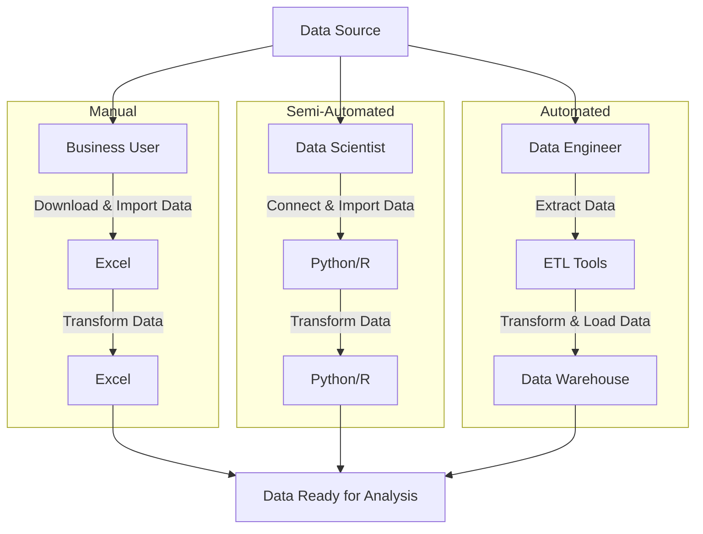
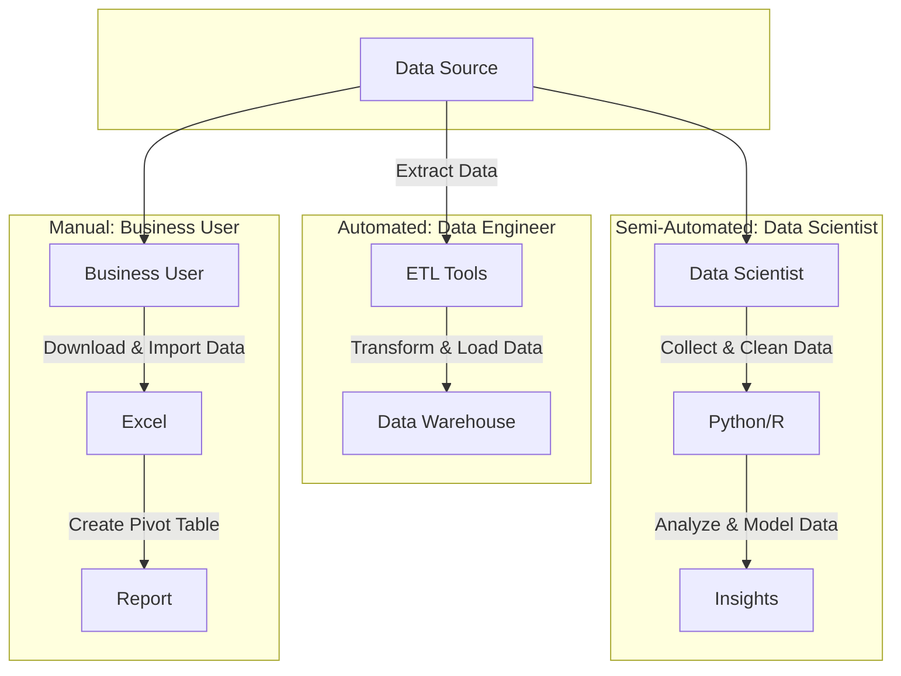
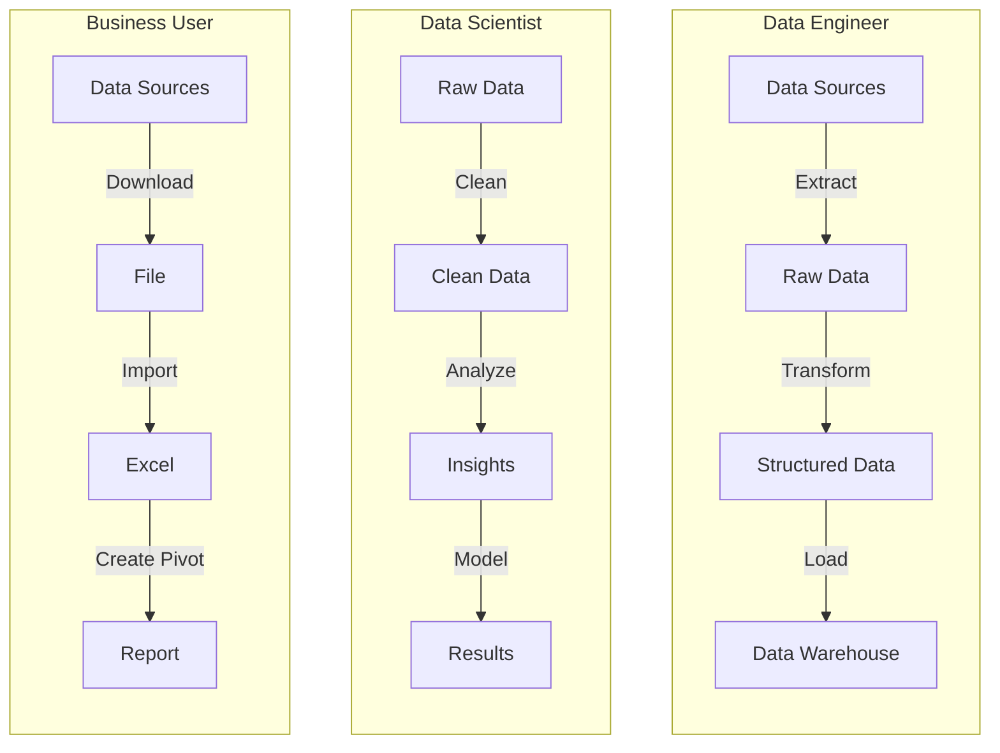

# Test

## Dataflow System Use Case: Process Data Stream

### Description:

This use case describes the process of ingesting, transforming, and storing a continuous stream of data in a dataflow system.

### Actors:

- Data Producer: Source of the data stream.
- Dataflow System: System responsible for processing and storing the data.

### Preconditions:

- The dataflow system is operational and configured to receive data.
- Data producers have established connections with the dataflow system.

### Triggers:

- Arrival of new data from the data producer.

### Basic Flow:

1. Data Producer sends a data stream to the Dataflow System.
2. Dataflow System ingests the incoming data stream.
3. Dataflow System applies defined transformations (e.g., filtering, aggregation) to the data.
4. Transformed data is stored in the appropriate data store or destination.

### Alternative Flows:

- If the incoming data stream is invalid or contains errors:
  - Dataflow System logs the error.
  - Dataflow System may attempt to recover or notify appropriate stakeholders.
- If the dataflow system encounters processing issues:
  - Error handling mechanisms are triggered.
  - System attempts to recover or notifies administrators.

### Postconditions:

- Transformed data is successfully stored in the designated data store.
- Dataflow System is ready to receive and process the next data stream.

### Exceptional Conditions:

- Loss of connectivity between Data Producer and Dataflow System.
- Dataflow System hardware or software failures.
- Data stream contains unexpected or invalid data.

### Related Use Cases:

- Dataflow System Use Case: Data Transformation
- Dataflow System Use Case: Data Visualization
- Dataflow System Use Case: Data Monitoring

### Notes:

- This use case focuses on the core process of processing data streams within the dataflow system.
- Additional use cases may address specific aspects such as data validation, real-time analytics, or system maintenance.





```{.mermaid loc=img format=svg theme=neutral caption=usecases}
---
title: Overview of three data pipeline use cases.
---
graph TB
    S[Data Sources] --> G
    S --> D
    S --> A
    subgraph " "
    direction TB
        G[Data Engineer] -->|Extract Data| H[ETL Tools]
        H -->|Transform & Load Data| I[Data Warehouse]
    end
    subgraph " "
    direction TB
        D[Data Scientist] -->|Connect & Import Data| E[Python/R]
        E -->|Transform Data| F[Python/R]
    end
    subgraph " "
    direction TB
        A[Business User] -->|Download & Import Data| B[Excel]
        B -->|Transform Data| C[Excel]
    end
    C-->T[Data Ready for Analysis]
    F-->T
    I-->T
```

```{.mermaid loc=img format=svg theme=neutral caption=gantt}
%%{init: {'theme': 'default', 'flowchart': { 'curve': 'linear' }}}%%
graph TD;
    DataProducer-->|Sends Data Stream|DataflowSystem;
    DataflowSystem-->|Ingests Data|DataTransformation;
    DataTransformation-->|Applies Transformations|DataStorage;
    DataStorage-->|Stores Transformed Data|Destination;

```



```{.mermaid loc=img format=svg theme=neutral caption=gantt}
---
title: Gantt Chart of the activities defined for this project.
---
journey
    title Data Journey
    section Manual
      Download Data: 1: Data, Business
      Paste into Excel: 1: Data, Business
      Create Pivot: 2: Business
    section Semi-Automated
      Refresh Data: 2: Data, Business
      Analyse: 3: Data, Business
    section Fully-Automated
```

```{.mermaid loc=img format=svg theme=neutral caption=gantt}
---
title: Gantt Chart of the activities defined for this project.
---
journey
    title Data Journey
      Unavailable: 0
    section Manual
      Downloaded manually: 1: Analyst
      Extracted with script: 2: Scientist
    section Automated
      Extracted with tools: 3: Engineer
      On schedule: 4: Engineer
      Cost Optimised: 5: Cost Engineer
```

```{.mermaid loc=img format=svg theme=neutral caption=gantt}
---
title: Data Journey
---
journey
    section Manual
      Downloaded: 0: Business User
      Extracted with script: 2: Data Scientist
    section Automated
      Extracted with ETL tools: 4: Data Engineer
      On schedule: 6: Data Engineer
      Cost Optimised: 8: Cost Engineer
```

<!-- Although data pipelines are often addressed in the context of engineering big data systems, the proposal put forth in this document will consider a broader scope of the term which also includes small data use cases, some of which are listed below and summarised in [Figure @fig:usecases]. -->

 <!-- [Figure @fig:usecases] gives an overivew of each of the use cases. -->
<!-- Each use case has the same _Source Endpoint_, but a different _Target Endpoint_. -->

<!-- The early stages of a data project often involve a consolidation of multiple datasets into a single data store or project spanning one or more tables. This paper will use the data engineering term _data ingestion_ to refer to this phase, concretely: the process of copying data from one or more sources to a single target. [Figure @fig:dataflow] below shows an example of a dataflow with multiple files landing in a single database schema, although the destination could also be a python project or another set of files in a folder. -->

<!-- Each of the use cases above involve a data pipeline which moves and transforms data to a destination. The classic sub-pattern of data pipelines is ETL (Extract-Transform-Load), however this proposal will focus on a sub-pattern called _ingestion_. _Ingestion_ has two functions: (1) its primary function is on the Extract-Load part of the pipeline; (2) with a secondary function performing transformations [@pipelines_pocket, p. 106] as part of the process. -->

<!-- [Table @tbl:elt] provides further descriptions of common pipeline patterns, it also provides some scope details relating to the project proposed in this paper. -->

<!-- - avoid technical terms (e.g., non-contextual transformation) in the introduction; it should be accessible to anyone with CS background -->

<!-- : Project scope via pipeline patterns. {#tbl:elt}

|      | Stands for         | Description                 | In scope |
| ---- | ------------------ | --------------------------- | -------- |
| E    | Extract            | Extracting data from source | Yes      |
| t    | Small-t transforms | Non-contextual transforms   | Yes      |
| L    | Load               | Saving data to its target   | Yes      |
| T    | Big-t transforms   | contextual transformations  | No       |
| ETL  |                    | Classic pattern: T before L | No       |
| ELT  |                    | Modern pattern: T after L   | No       |
| EtLT |                    | Modern pattern: small/big T | No       |
| EtL  |                    | Sub-pattern: ingestion      | Yes      | -->

<!-- - Table 2: at this point I don't know what is the problem you're trying to solve, so having pipeline patterns listed here and whether they are in the project scope is not particularly useful for the reader

- Table 1/2/3: I find them not much informative, sparse, and out-of-context. Better explain few cases in text

For the purpose of this paper, non-contextual transformations are defined as those which can be executed using information in a single tabular dataset. Using relational database (SQL) lingo, non-contextual transformations cannot use a `JOIN` clause to refer to data from another table. [Table @tbl:tfm] gives some examples of common examples of these transformations. Conversely, contextual transformations are those that combine two or more datasets/tables and are not in scope for the proposed project. -->

<!-- : Project scope via non-contextual transformations. {#tbl:tfm}

| Transformation           | Example                      | In scope |
| ------------------------ | ---------------------------- | -------- |
| Create/drop column       | Create row identifier column | Yes      |
| Convert data types       | String to date               | Yes      |
| Filter rows              | Remove duplicates            | Maybe    |
| Split/join strings       | Concatenate columns          | Maybe    |
| Obfuscate sensitive data | Encrypt birth date           | No       |
| Aggregate                | Sum total revenue by year    | No       | -->

<!-- The problems and solutions put forth in this document focus on application in the business context, especially internal-facing data products such as analytical reports and dashboards. Despite this narrow focus in examples and use cases, it is expected that the solutions proposed may also be used in outward-facing data product projects as well as in research and academia. -->

<!-- - Files usually come from different systmes and have very different formats.
- As the project progresses, gaps in data sources are identified and filled with more files.
- As the project progresses from an ad-hoc prototype to a sustainable solution, some data sources move from file-based to API/connection based.
- There is a dual requirement to explain how data has been transformed: one way to business users for sign off and another to technical users for handover. -->

```{.mermaid loc=img format=svg theme=neutral caption=sequencedp2}
---
title: Evolution of an internal-facing data product with lineage.
---
sequenceDiagram
    autonumber
    box
      actor Business as Business User
      actor Scientist as Data Scientist
      actor Engineer as Data Engineer
    end
    participant Data
    Business->>+Scientist: Can you make this?
    Scientist->Data: Create a data product to ingest (in-memory) and serve
    Scientist->>-Business: Sure, here you go
    Business->>+Scientist: Can you explain the lineage?
    Scientist->Scientist: Manually create a business lineage graph explaining data
    Scientist->>-Business: Here is a business graph
    Business->>+Engineer: Can you automate this?
    Engineer->>+Scientist: Can you explain?
    Scientist->Scientist: Manually create a technical lineage graph explaining data
    Scientist->>-Engineer: Here is a technical graph
    Engineer->Data: Use ETL tools to<br>ingest (persisted)<br>on schedule
    Engineer->>-Business: Sure, here it is in real-time
```

Another challenge with pipelines is the ability to communicate explanations of data pipelines across a diverse team. [Figure @fig:sequencedp2] shows a scenario where the problem in focus is how the pipeline can be explained to different types of users: business (Point 5) and technical (Point 9). With a pipeline defined in a plain text configuration language as proposed, it is trivial to extract and present lineage graphs. A common way to communicate data pipelines is to use a Directed Acyclic Graph (DAG) to show how different parts of the data are related.

<!-- **Notes**

-
- Data Scientist is responsible for documenting details of each step such as data sources used, date accessed, cleansing/transformations performed, altough most of these steps can still be determined by examining the Python scripts. -->

**Notes**

<!-- -  -->
<!-- - Business User is responsible for documenting details of each step such as data sources used, date accessed, cleansing/transformations performed. -->

 <!-- is a semi-automated process, setup is manual but repetition and iteration can be automated with the Python scripts used. -->

<!-- **Notes**

-
- Data Engineer is responsible for documenting details of each step such as data sources used, date accessed, cleansing/transformations performed, altough most of these steps can still be determined by examining the ETL scripts and/or workflows. Most advanced ETL tools have the ability to store metadata on each pipeline workflow. -->

<!-- This is mostly a manual process, though some more technically savvy users may automate some parts of the process. -->

### Use Cases

This section lists examples of data pipeline use cases, each use case contains a single actor and gives a basic example of how each actor may use a pipeline.

#### Business user pipeline destined for Excel

This use case describes a non-technical business user performing a manual process of downloading one or more files for consolidation and analysis in Excel.

Use Case Flow:

1. Business User manually downloads one or more datasets in Excel, csv or similar file formats from online portal, application or email.
2. Business User copies/pastes or imports data into a single Excel file.
3. Business User performs transformations on data.
4. Data is ready for analysis/pivots.

```{.mermaid loc=img format=svg theme=neutral caption=dp1}
---
title: Business user pipeline.
---
graph LR
    S["Web\nPortal"] -->|"Download"| B[File\nSystem]
    B -->|"Import"| C[Excel]
    C -->|Transform| C
```

#### Data science pipeline using Python

This use case describes a data scientist connecting to or downloading one or more data sources for consolidation and analysis in Python. This process can be manual, automated or a combination of both.

Use Case Flow:

1. Data Scientist downloads data in Excel, csv or similar file formats from online portal or application, and/or connects directly to data via database connection or API.
2. Data Scientist creates script(s) to load datasets into pandas dataframes.
3. Data Scientist scripts transformations on data.
4. After running scripts, data is ready for analysis in pandas dataframe endpoints.

```{.mermaid loc=img format=svg theme=neutral caption=dp2}
---
title: Data science pipeline.
---
graph LR
   T["Web\nPortal"] -->|"Download"| B[File\nSystem]
   B -->|"Load via\nScript"| E
     S["API"] -->|Load via\nScript| E[Python]
    E -->|Transform| E
```

#### Data engineering pipeline using ETL tools

This use case describes a data engineer setting up ETL tools to connect to one or more data sources for consolidation and serving in a data warehouse or similar. Setup is manual but ETL process is normally repeted on a schedule using ETL tooling.

Use Case Flow:

1. Data Engineer connects directly to data via database connection or API.
2. Data Engineer uses ETL tools to load data in an intermediate storage or in-memory for transformations.
3. Data Engineer users ETL tools to performs transformations and/or cleansing operations on data.
4. Data Engineer loads data to a data warehouse or similar storage, ready for downstream analysis.

```{.mermaid loc=img format=svg theme=neutral caption=dp3}
---
title: Data engineering pipeline.
---
graph LR
    S["Database"] -->|Load via\nETL System| H[ETL System]
    H -->|Transform| H
    H -->|Load via\nETL System| I[Data\nWarehouse]

```

```{.mermaid loc=img format=svg theme=neutral caption=dp0}
---
title: Generic data pipeline.
---
graph LR
A["Source\nEndpoint"] --> B[Staging\nEndpoint]
B -. Transform .-> B
B --> C[Target\nEndpoint]
C -. Transform .-> C
%% C <-->|Serve| D[Consumer]
```

<!-- Data can be _transformed_ at any of the endpoints, but transformations rarely occurs at the source. -->

```{.mermaid loc=img format=svg theme=neutral caption=dp01}
---
title: Generic data pipeline.
---
graph LR
A["Source\nEndpoint"] --> B[Staging\nEndpoint]
B -. Transform .-> B
B --> C[Target\nEndpoint]
C -. Transform .-> C
%% C <-->|Serve| D[Consumer]
```

```{.mermaid loc=img format=svg theme=neutral caption=dp1}
---
title: Data pipeline project phase 1 to-be.
---
graph LR

subgraph "config"
  T
  B
end

  T["Web"] -->|"Download"| B[File\nSystem]
  T -->|Scrape Script| E
  F["Email"] -->|"Download"| B[File\nSystem]
  B -->|"Load\nScript"| E
  S["API"] -->|Load\nScript| E[Python]
  E -->|Transform\nScript| E
  E -->|Load\nScript| Q[SQL DB]
  Q -->|Transform\nViews| Q
  Q -->|Load\nScript| X[Target]
```

```{.mermaid loc=img format=svg theme=neutral caption=dp2}
---
title: Data pipeline project phase 2.
---
graph LR
  T[Web] -->|Scrape Script| E
  F["Database"] -->|"Load\nScript"| B[Network\nShare]
  B -->|"Load\nScript"| E
  S["API"] -->|Load\nScript| E[ETL\nSystem]
  E -->|Transforms| E
  E -->|Load\nScript| X[Target]
```

Pipelines are made up of one or more pipeline units, each unit connects two _endpoints_.

```{.mermaid loc=img format=svg theme=neutral caption=dp0}
---
title: Generic data pipeline.
---
graph LR
A["Endpoint 0"] -->|Pipeline Unit| B[Endpoint 1]
B -->|Pipeline Unit| C[Endpoint 2]
%% C <-->|Serve| D[Consumer]
```

```{.mermaid loc=img format=svg theme=neutral caption=dp0}
---
title: Data pipeline example.
---
graph LR
A[csv file] -->|Load| B[Database]
B-->|Transform|B
B -->|Load| C[Reporting System]
%% C <-->|Serve| D[Consumer]
```

Linkage

<!-- [Figure @fig:sequence0] shows a simple example of a data pipeline representing the minimal number of components. In reality a data pipeline could have several intermediate enpoints and multipe engines. -->

<!-- , and a single pipeline could also have several different engines working at different points of the pipeline. -->

<!-- , while creating quality documentation that can be used to communicate how data is moved and transformed from source to target. -->

<!-- In this work I have identified several challanges that no existing system can solve. -->

- Multiple data pipelines for multiple projects managed simultaneously. Solution requires a system to move the source data into a target database into tables. The point here is that someone who only ever deals with a single data pipeline can use existing tools as the percentage of time taken to manage this part of the project decreases significantly.

<!-- The processes that move and transform the data along a pipeline begin and end at _endpoints_. An _endpoint_ is place or interface where data is stored and/or accessed. This can be a data file such as a csv, a database, an API or an in-memory structure such as a dataframe. Endpoints will be discussed below in terms of _Data Sources_ and _Data Targets_. -->

<!-- Two There are two types of endpoints that will be discussed in this paper: _Source_ and _Target_ which is whre the pipleline begins and ends. -->

 <!-- _Source_ is where a data pipeline begins and normally a pipeline will have multiple sources. _Target_ is where a data pipeline ends, where data is ultimately loaded to for downstream access. -->

<!-- Facilitating the movement of data between endpoints is a pipeline engine. An engine could be a user performing the acions manually or an application performing the actions on a trigger or schedule. Apart from moving the data, the engine is also responsible for transforming the data. _Transformations_ change the state of the data: some basic examples include changing, removing and summarising data. -->

 <!-- At a minimum, a data pipeline will have a single source and a target, but can also have one or more staging endoints. A basic example of a data pipeline with each of type of endpoint is in [Figure @fig:dp0]. -->

<!-- _Staging_ is an intermediate endpoint, often a place where data is temporarily stored in order perform transformations before being moved to the target endpoint. -->

<!-- Although there are several different paradigms and patterns in use with data pipelines. This paper will focus on a simple pattern which involves three subjects: Source, Target and Engine. -->

<!-- The data pipeline use case addressed in this paper is one of multiple sources being moved to a single target. It is typical in a data project to have different sources in different formats from different sysetms. -->

### Motivational Use Case

<!-- As a data specialist I have worked on many data pipelines over the past 25 years. The next sections will highlight some challanges that I and others face when dealing with data pipelines. An idea for a solution that will address some of these problems will be subsuquently proposed, explored and planned in the following sections. -->

To summarise, the problems associated with data ingestion via code are as follows:

- Each unique source requires different code / module to handle its import (pull), transformation, and export (push).
- Contextual data (i.e. location, filename), if reuqired, has to be hard-coded into the transformation portion of the code.
- Coding all of the data sources manually is time consuming and difficult to track by reading the code.
- Ingestion configuration is coupled with the application performing the ingestion.

First, let's look at some of the main challanges for data ingestion:

1. Data endpoints can come in a variety formats and layouts, this requires each data format to be handled in code differently.
2.

Taking some clues from The Practical Programmer, we can follow the tips:

> Tip 55: Parameterize Your App Using External Configuration

> Tip 25: Keep Knowledge in Plain Text

> Tip 15: DRY-Don't Repeat Yourself

This is the question that is resolved to be answered below. This comes down to the first steps in a data pipeline where data is scattered across different endpoints and needs to be moved to a single endpoint for further processing. An _endpoint_ is place or interface where data is stored and/or accessed. This can be a data file such as a csv, a database, an API or an in-memory structure such as a dataframe.

Source data for pipelines are normally provided in a varity of source and target a single destination. _endpoints_. Some examples of physical file formats are csv files, Excel files and json documents. Each of these formats can have Customer provides data in a variety of sources that needs to be loaded to a database for further processing. Data sources are frequently updated, sometimes sources are added, removed and replaced. A solution is required that has the ability to update the target database reflecting the changes to the source. Data sources can change from file-based to connection/API-based as the project matures. For example, a customer table once provided as a csv file could change to an API connection which can directly query the customer data.

Setup conditions:

1. Any files containing source data are not permitted to be manually modified.
2. Any changes to source data should occur in the transformation step by the pipeline engine.
3. Transformations should be minimal, unless required to make the data fit into a table at the target.

The alternative involves creating several disparate scripts, each customised for a particular data source and its settings.

A typical data pipeline has several sources in distinct formats. This creates a necessesity to tailor an import script to account for each system in a different way.

The use case being addressed in this paper is taking data from multiple sources and importing it into a database.

This use case describes a data scientist connecting to or downloading one or more data sources for consolidation and analysis in Python. This process can be manual, automated or a combination of both.

Flow:

1. Data Scientist downloads data in Excel, csv or similar file formats from online portal or application, and/or connects directly to data via database connection or API.
2. Data Scientist creates script(s) to load datasets into pandas dataframes.
3. Data Scientist scripts transformations on data.
4. After running scripts, data is ready for analysis in pandas dataframe endpoints.

```{.mermaid loc=img format=svg theme=neutral caption=dataflow}
---
title: Example dataflow
---
graph LR
subgraph \nFILE SYSTEM
  fs[ ]
  subgraph ./data sources/
      a1[products.csv]
      subgraph transactions.xlsx
          z1[january]
          y1[february]
      end
      subgraph customers.xlsx
          x1[sold to]
          w1[ship to]
      end
  end
end
subgraph \nDATABASE
    db[ ]
    subgraph raw:schema
        a1 --> b1[products]
        z1 --> d1[transactions]
        y1 --> d1
        x1 --> u1[sold to]
        w1 --> v1[ship to]
    end
end
style fs height:0px
style db height:0px
```

Below is a typical high-level outline for the technical aspects of a data pipeline project I would follow:

<!-- I developed a workflow for working with new data projects as follows: -->

1. Create a SQL database for staging.
2. Import all source files into the database as tables.
3. Create views/tables to perform transformations on the data.
4. Export transformed data to target endpoint for downstream consumption.
5. Implement changes to sources, transformations as requirements change and/or sources modified and repeat steps 1-4.

```{.mermaid loc=img format=svg theme=neutral caption=dp1}
---
title: Data pipeline project phase 1 as-is.
---
graph LR
  T["Web"] -->|"Download"| B[File\nSystem]
  T -->|Scrape Script| E
  F["Email"] -->|"Download"| B[File\nSystem]
  B -->|"Load\nScript"| E
  S["API"] -->|Load\nScript| E[Python]
  E -->|Transform\nScript| E
  E -->|Load\nScript| Q[SQL DB]
  Q -->|Transform\nViews| Q
  Q -->|Load\nScript| X[Target]
```

Managing change was one challange that is partially addressed in the transformation layer. The idea is to keep everything as text so that transformations can be easily traced in order to be able to explain what transformations took place on the data simply by looking at, or deriving from the logic present in the SQL endpoint which performs the transformations.

The part that was more difficult to trace is the importation of source data into the transform endpoint (SQL database). For any given project source data could come in a myriad of formats and/or endpoints. To name a few, it would be quite common to receive data in Excel, csv and fixed width files, APIs as well as html downloads. Each of these files could have different layouts and structure as well.

<!-- 5. Communicate to business users all data sources and transformatoins that were performed to create the target data, leaving out technical deatils.
5. Communicate the same to the technical team, but with more technical details. -->
<!-- In addition to the above actions, the following tasks were also required: -->

<!-- , depending on the service level. For example a premium SLA would provide all of the logic performed on the intermediate tables while a basic SLA would provide only an explaination of the logic between source and targets. -->

<!-- In summary, my use case is divided into two related categories: create and maintain a data pipeline (steps 1-4) and explain the data pipeline steps (5-6). -->

<!-- #### Data pipeline creation and maintenance -->

When a data project begins, it is helpful to have a quick way to get it started with the source data available. The source data is often supplied in the form of files delivered by a combination of business and technical support staff. The solution I settled on is to save all source files in a folder and having a python script import each file to the database. This script would infer the name of the target table based on the file's name or contents, for example:

- if it is an Excel file, import each worksheet into it's own table using the name of the worksheet as the table name.
- if it is a csv file, import into a table using the name of the file as table name.

This worked for many cases, but there were cases where this default behaviour would not be sufficient. For example, in some cases the sheets in the Excel file should all go to the same table and the sheet name should be a column in that table. In this case I would create ad-hoc workarounds in the code or put hints in the filename or sheet name that would trigger a different action in the import script. In other cases I would manually modify the source files to allow for the defaults to be acceptable. One workaround I commonly used is to put a "TRUNCATE" keyword in the filename so the script would know to first remove all existing rows in the database before importing.

<!-- This solution also presented additional challanges:

- after a file is imported into the database, it was moved to an "imported" folder. If this file was later descoped the original file would have to be manually deleted.
- if a file is updated with more information, the appropriate logic would have to be triggered to update/replace the table in the database if it has a new structure. One workaround I commonly used is to put a "TRUNCATE" keyword in the filename so the script would know to first remove all existing rows in the database before importing. -->

This was the first inspiration for what is being proposed below: a declarative configuration language for the import phase of a data pipeline. Instead of relying on ad-hoc changes to scripts and adding keywords to the files, a configuration language should exist to cover all of the common tasks and exceptions and rules that should be applied to the importation of data. If no configuration accompanies a file, then defaults will be applied to the import.

<!-- #### Data pipeline explanation

As a data project progresses, communicating how data has been moved and transformed from the sources to target. This is important on two fronts and each have their own requirements:

- Communicate pipeline to the business to ensure it aligns with business requirements.
- Communicate to technical team in order to ensure a smooth handover for sustainable phase of the project.

I would aproach this part of the requirement by using scripts to inspect the SQL that defined the transformations and create a lineage graph which would demonstrate how source data is mapped to the target data. This was cumbersome and error-prone as the same SQL can be expressed in many ways.  -->

As outlined in the use cases above, there are different methods and tools used for defining a pipeline. Some are manual, such as downloading a dataset and importing into Excel, whiles others are automated using an ETL. A problem arises when users across these different use cases are working together.

The initial inspiriation for this project was born out of a having an easy way to use multiple files stored in a single directory as a source for a data pipelie.

- there lacks a standard way to quickly move multiple sources into a single destination, allowin for sensible defaults but allowing changes easily.
-

- Section 1.1 brings some challenges. I would restructure the intro as follows:

  - present challenges that users are facing; perhaps no need for both Figures 1 and 2; I like them but one figure may be sufficient to convey the same messages

  - Why are these challenges difficult and cannot be solved using existing tools/techniques?

  - expand the explanation of the use case from that figure (who does what, individual steps); after reading the two paragraphs from Sec 1.1, not sure that the problems are clearly explained

- having an example of configuration would be helpful to the reader

- _lineage_: In the context of data pipelines, metadata which explains how data has been moved and/or transformed from source to target.

- Although technologies for managing pipelines are always changing, the underlying fundamentals of the data itself remains the same. A table is always a table, a row is always a row. However when tooling changes it often necesetates a rework of defining the data in the new system.
- Different users use different tools and processes for accessing the same data. Sometimes a pipeline may be passed from one team to another, and redundancy is introduced as each new team has to reproduce the pipeline in the tools of their domain.
<!-- - Data pipeline explanability is not straightforward, oftern requiring manual creatiion of directed graphs to explain how the data pipeline has been executed. Adding further complication, sometimes graphs of differing details are required for different audiences (technical vs. non-technical).
- As defined at the top of this chapter, data pipelines normally move data from one or more sources to a single destination. Much of the tooling available today does not necessarily take the many to one paradimn into account, requiring a user to redefine the destination for each source, introducing further redundancy. -->
- With an ever increasing amount of data end points available for analysis, it should be trivial to change destinations of pipelines to test for speed/cost optimisations. However, existing tooling makes swapping an end point for a data pipeline cumbersome and error prone.

<!-- As a permanent member of staff creating and maintaining, data pipelines were a relatively minor part of my work-load. However as a consultant working on many projects mostly in their inception, I have come across many anti-patterns that can be improved upon with a new solution proposed below. -->

Each programming language, database platform, ETL system and data analysis software has distinct methods for implementing extraction and loading (ingestion) logic. Lacking is a system that can be used interchangeably across different formats and tools. A user-friendly system for declaring data ingestion can have several use cases, some of which are as follows: (1) less time spent writing code to extract, load, move or convert data; (2) easily swap a pipeline from one datastore to another; (3) Seamlessly migrate data projects from in-process to physical storage; and (4) generate data lineage directly from the configuration.

<!-- Listed in [Table @tbl:pipelines] is a range of use cases for the data pipeline, each with its own set of tools and methods for ingesting the required data, this point is further illustrated in [Figure @fig:sequencedp]. -->

Lacking is a clear way to define and communicate data ingestion across different use cases and end points. [Figure @fig:sequencedp] shows how a data pipeline may pass between different members of a team, each with their own tooling and methods for handling the data. This introduces process redundancy as each participant is re-creating, or converting a pipeline into their own tooling in order to ingest the same data. Some of the ingestion work performed in point 1 is repeated in points 3, 6 and 9.

<!-- Each user has their own set of tools and processes for ingesting the data into the data product. -->

```{.mermaid loc=img format=svg theme=neutral caption=sequencedp}
---
title: Evolution of an internal-facing data product.
---
sequenceDiagram
    autonumber
    box
      actor Business as Business User
      actor Scientist as Data Scientist
      actor Engineer as Data Engineer
      actor DBA as DBA/Cloud Engineer
    end
    participant Data
    Business->Data: Manually ingest: download and import into Excel
    Business->>+Scientist: Can you enhance<br>what I did in Excel
    Scientist->Data: Write a Python script to ingest
    Scientist->>-Business: Sure, run this<br>script to refresh
    Business->>+Engineer: Can you automate this?
    Engineer->Data: Use ETL tools to ingest on schedule
    Engineer->>-Business: Sure, here it is in real-time
    Business->>+DBA: Can we save money on this?
    DBA->Data: Test ingestion with<br>different end points
    DBA->>-Business: Sure, here it is in a cheaper backend
```

Point 9 in [Figure @fig:sequencedp] also highlights another problem that can arise with data pipelines: the ability to change end points seamlessly. In this example the DBA or cloud engineer may be experimenting with different database backends to find the most effective solution, optimising for cost in this case or speed in another. Allowing a mechanism to easily test and change end points can reduce vendor lock-in risk when building data products.

<!-- , leaving free the option to test and move to different end points/vendors. -->

<!-- Each subsequent actor is building on work done previously, but using different tooling to accomplish a similar goal. -->

<!-- DAGs are also used in data engineering to build task-based workflows, this solution will use DAGs to illustrate data lineage. -->

 <!-- This addresses the issues of table-level lineage and column-level lineage: the former providing a high-level detail of a dataflow and the latter providing a lower-level detail. Although lineage visibility is available in some tools used in analytics and ETL packages, there is lacking a standard that can be used and understood by all. -->

<!-- For example, a data scientist may begin working with data to create a data product and when completed hand it over to a data engineer for automating. In this example, the data engineer may be using python scripts to import source data into dataframes using Python scripts, while the data engineer may use ETL tooling to define a pipeline which stores data on disk for later retrieval by the data product. This highlights one of the challenges with managing data pipelines: they are often built with varying toolsets that include one or more languages and/or toolsets. -->

<!-- Setting up the data ingestion process often involves many manual steps of data discovery, cleansing, standardisation and mapping to bring it into the target data store. Depending on the project type the logic for these transformations can take various forms, from manually copy pasting data into an Excel spreadsheet to coding transformations in a python/pandas project. This makes communicating and converting these transformations across different teams a challenge. -->

<!-- It can also introduce reproducibility issues when a decision to change a data definition, source or target while keeping the remainder of the logic consistent. -->

<!-- To summarise, the ingestion phase of a data project presents some challenges:

1. Redundancy when transferring to different tools/databases/platforms.
2. System dependant: work done is not easily transferred to an alternative system (change in database backend, switching from in-memory analysis to data store)
3. Lineage: steps taken to transfer data not easily discernable from differing logic by missing manual steps, decoding logic used in different systems -->
<!-- 4. Manual logic defined that could otherwise be automated (mapping of fields, definition of data types) -->

<!-- To summarise, there is lacking a general language for describing a data pipeline and its transformations that can be used to change end points . -->

<!-- This makes it difficult to have a common cross-system language for describing such pipelines to facilitate the swapping of one end point for another. -->

> The great virtue of a declarative language is that it makes the intent clear. You're not saying how to do something, you're saying what you want to achieve. [@patterns_eaa, p. 39]

The solution proposed below seeks to create a declarative configuration system for data ingestion that can be used across different use cases. The name of this solution is _eel_: easy-extract-load and some of the project's goals are listed in [Table @tbl:goals].

<!-- One benefit of such a system is that it can facilitate communication between an interdisciplinary team with a common language to describe how data is ingested and transformed. -->

: Eel project goals. {#tbl:goals}

| Goal        | Measure                                             |
| ----------- | --------------------------------------------------- |
| 1. Friendly | Configuration optional, inferring suitable defaults |
| 2. Readable | Text-based, Human-readable configuration language   |
| 3. Agnostic | Works across different end points seamlessly        |

<!-- | 4. Explainable | Lineage graphs included


1. Friendly and intuitive: should be easy for a user to get started without the burden of setting up configuration files manually.
2. Readable plain text configuration: All configuration in logical folder structure and with one or more plain text configuration files defining end points and transformations.
3. Technology agnostic: should be able to swap different end-points without requiring a re-write of mapping/transformation logic.
4. Explainable: system can create lineage graphs explaining the mappings and transformations defined in the configuration.

Revisiting [Figure @fig:sequencedp] with eel, points 3, 6 and 9 could be using the same eel configuration which defines the ingestion instead of redefining the ingestion across different tools. Likewise, [Figure @fig:sequencedp2] can be remained by creating the lineage graphs in step 5 automatically and reducing the need for communication between the Data Scientist and Data Engineer (points 8-10), since all required ingestion information is already included in the eel configuration.

Points 2 and 11 in [Figure @fig:sequencedp2] highlight an additional benefit of the solution: the ability to switch from an in-memory storage solution to a persisted solution. This can be especially helpful for rapid prototyping and testing of data products.

<!-- - Design a declarative language (YAML) and accompanying project
  structure for extracting and loading data to/from standard file
  formats or databases, including in-process memory structures as
  targets (i.e., pandas data frames).

- Design CLI system to interpret language and optimally orchestrate
  extract/loading procedures, allowing for configuration trees (for
  inheriting config from parent branches) and inferred configuration through data introspection
  (i.e., type inference, reading existing meta-data from sources).

- Allow non-contextual transformations to be defined (i.e. column
  which defines source, index column) -->

<!-- Logical project/configuration structure -->
<!-- A project definition is flexible:
- A single data file such as a csv.
- A single yaml file defining end points.
- A directory containing one or more of the above, with an arbitrary number of sub-directories.
- Defaults are generated by the system and can optionally be written as configs to be modified. -->
<!-- - Minimal configuration: data introspection for detecting tables, fields and data types. -->

<!-- With a common way to share ingestion pipelines, they will also have access to a common way to communicate data lineage.

Additional objectives for the project are as follows: -->

<!-- The scope of this solution is a subset of a data pipeline ([Table @tbl:elt]) and a subset of transformations ([Table @tbl:tfm]) in order to develop a system that may be built upon in later phases. -->

<!-- This paper proposes a project that will develop and implement a first phase of a project that will eventually be the first phase of a system for creating declarative pipelines. Focusing on the ingestion phase and common formats, the system could be extended to account for more transformations in a later project phase. -->

<!-- To fully develop a data pipeline language is a large undertaking. Doing some quick calculations, let's say there are 10 file formats + 10 databases leaving us with 20 different possible data stores. Just "converting" each of these stores to another leaves us with 400 simple transformations to support and test. This leaves out that transformations vary and some are so custom that to define them in simple terms may not be possible. Let's say that 20 different simple transformations can be defined, this leaves us with 8000 different possibilities to test.

Given the scope of such an undertaking, the below proposal will narrow the scope to the early part of the pipeline known as _data ingestion_. Data ingestion is the part of the pipeline which moves data from one data store to another data store, optionally applying non-contextual transformations. -->

<!-- What will be proposed below is the creating of a common configuration language for defining a data pipeline that can be shared across functions and that can work with different data formats, databases or data stores. [Table @tbl:scope] summarized. -->

Modern data pipelines have many features: most of which will not be in scope for this project. [Table @tbl:scope] lists elements of a modern data pipeline and how they are scoped in relation to this project.

: Project scope summary. {#tbl:scope}

| Element          | In Scope       | Out of Scope | More Details     |
| ---------------- | -------------- | ------------ | ---------------- |
| Sub-pattern      | Ingestion/EtL  | ETL/ELT/EtLT | [Table @tbl:elt] |
| Transformations  | Non-contextual | Contextual   | [Table @tbl:tfm] |
| End points       | See Details    | All others   | [Table @tbl:ep]  |
| Schema type      | Tabular        | Document     |                  |
| Concurrency      | Single-thread  | Multi-thread |                  |
| Scaling          | Single-node    | Multi-node   |                  |
| Locality         | Local/Network  | Cloud/Online |                  |
| Transform Engine | python/pandas  | Dynamic      |                  |
| Load table       | Insert/Create  | CDC/Continue |                  |
| Lineage support  | Table-level    | Column-level | Data-based DAGs  |
| Method           | Batch          | Streaming    |                  |
| Interface        | CLI/Yml schema | GUI          | Use IDE/editor   |
| Orchestration    | Static         | Dynamic      |                  |
| Tracking/Stats   | Not in Scope   |              |                  |
| Security         | Not in Scope   |              |                  |

- Table 5 -- lots of unexplained technical terms, not very useful to the reader (remember your thesis will be read by non-experts) in understanding what you're trying to achieve

[Table @tbl:scope] lists some of the end points that will be supported in this phase of the project, those not listed are implicitly not in scope. Note the distinction between container and table: for the purposes of this project a container is analogous to a directory which contains one or more tables and/or containers.

: Project scope data store end points. {#tbl:ep}

| Class      | Store     | Capacity  | Scope: source | Scope: target |
| ---------- | --------- | --------- | ------------- | ------------- |
| File       | Excel     | Container | Yes           | Yes           |
| File       | csv       | Table     | Yes           | Yes           |
| Database   | mssql     | Container | Yes           | Yes           |
| Database   | sqllite   | Container | Yes           | Yes           |
| In-process | dataframe | Table     | No            | Yes           |

<!-- To fully develop a mature data pipeline language is a large undertaking. Doing some quick calculations, let's say there are 10 file formats + 10 databases leaving us with 20 different possible data stores. Just "converting" each of these stores to another leaves us with 400 simple transformations to support and test. This leaves out that transformations vary and some are so custom that to define them in simple terms may not be possible. Let's say that 20 different simple transformations can be defined, this leaves us with 8000 different possibilities to test. -->

<!-- Given the scope of such an undertaking, the below proposal will narrow the scope to the early part of the pipeline known as _data ingestion_. Data ingestion is the part of the pipeline which moves data from one data store to another data store, optionally applying non-contextual transformations. -->

<!-- | DAGs            | Data-based     | Task-based   |                  | -->
<!-- | Versioning      | Implicit       | Explicit     | Text-based       | -->

```{.mermaid loc=img format=svg theme=neutral caption=sequencedp}
graph LR
    A[Data Pipelines/ETL] --> B[Challenges]
    B --> C2[Slow Start Solutions]
    B --> C3[Manual Mapping/Coding]
    B --> C4[Imperative Non-standard Code]
    A --> D[Supervisor Discussion]
    D --> E[Success Criteria]
    D --> E2[Benchmarks]
    A --> F[Interesting Points]
    F --> G[Easy Target Change]
    F --> H[First Step to General Pipeline Solution]
```
